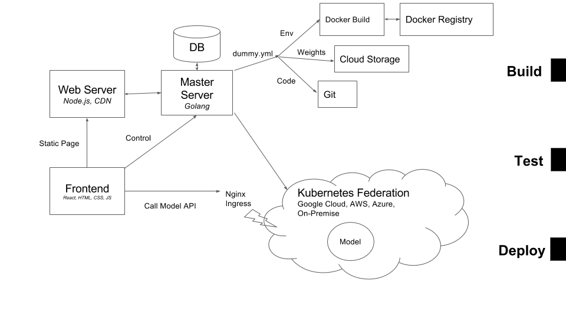

# Dummy.ai MVP

[](https://circleci.com/gh/dummy-ai/warpdrive)


> World's Best Models, Built by the Community.


Dummy is a marketplace for machine learning models. Researchers deploy and publish models as "lambda function", paying a low cost of serving per request. Developers discover intereseting models and integrate them into applications through API.

Links: [[Documentation]](http://docs.dummy.ai/)  


## Objective

Our goal is to differentiate through the following competitve advantages:

1. **Low friction to start** Anyone can start uploading machine learning models in minutes.
2. **Low cost of serving** Models are served like lambda functions and incur cost only when the API is called.
3. **High bar for initial cohort of models**. The initial set of models on the platform will be of high quality.


## Architecture



The dummy architecture is built to scale. We created microservice framework using open-source Kubernetes and Docker. Dummy is also designed with the following features in mind:

* **Serverless**. The end user does not need to worry about server management and scaling. 
* **Cloud-agnostic**. No vendor lock-in. Our system can run on Google Cloud, AWS, Azure, Alibaba Cloud. It also runs in multiple regions within each cloud vendor. 

With features like Kubernetes Federation, we can not only deploy the cluster to Google Cloud, AWS, Azure or private cloud, but also join these clouds to provide unified interface.


## Compoments

### Kubernetes Setup

The first component is a pipeline based on packer and terraform to build and manage cloud infrasturcture. 

Currently, it is tested on 

| Vendor  |  Script | 
|---|---|
| Google Cloud  |  `kube/gcloud` |  


### Web Server

`web-server` is a node.js server to provide static contents and flashy webpages.

TODO: add more description here.

### Master Server

`master-server` is a performant server written in Go that 

- communicates with web server to serve content
- manages user code, data, model in database and cloud storage
- controller for computing resources in Kubernetes


### Ingress

The Ingress is an nginx controller to redirect traffic to model API endpoints. The configuration is managed by `master-server`. 

To setup, go to `ingress` and run `make all`.

### Warp

`warp` is the CLI written in `python`. 

### Other Minor Components

**Documentation**. We use `mkdocs` to serve document pages. 

To start the process, go to `docs/` and run 

```
mkdocs serve
```

**Docker**. A couple of model environments are provided, including python3, tensorflow, pytorch, etc.

**Examples**. A few projects checked in as submodules. They are used as examples to show how `Warpdrive` can be used.
